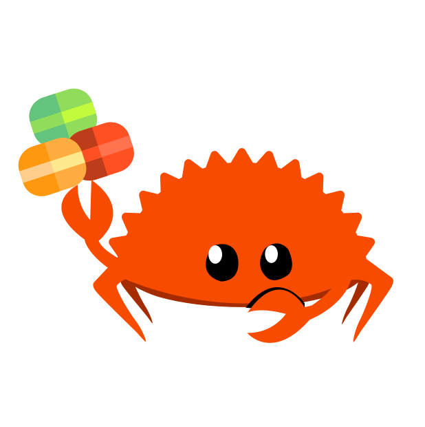

# macaroon

Rust implementation of
[macaroons](https://research.google.com/pubs/pub41892.html).

[](https://crates.io/crates/macaroon)
[](https://github.com/macaroon-rs/macaroon/actions)
[](https://codecov.io/gh/macaroon-rs/macaroon)

NOTE: THIS LIBRARY SHOULD NOT BE CONSIDERED SECURE AND HENCE SHOULD NOT BE USED IN PRODUCTION UNTIL IT PASSES A FULL SECURITY AUDIT. THE API IS ALSO LIKELY TO HAVE BREAKING CHANGES BETWEEN 0.X MINOR VERSIONS AND SHOULD THEREFORE NOT BE CONSIDERED STABLE.

## What are Macaroons?

Macaroons are bearer tokens (similar to cookies) which encode within them
criteria within which the authorization is allowed to take place (referred to as
"caveats"). For instance, authorization could be restricted to a particular
user, account, time of day, really anything. These criteria can be either
evaluated locally (a "first-party caveat"), or using special macaroons
("discharge macaroons") generated by a third party (a "third-party caveat").

A first-party caveat consists simply of a predicate which, when evaluated as
true, authorizes the caveat. The predicate is a string which is either evaluated
using strict string comparison (`satisfy_exact`), or interpreted using a
provided function (`satisfy_general`).

A third-party caveat consists of a location string, an identifier, and a
specially-generated signing key to authenticate the generated discharge
macaroons. The key and identifier is passed to the third-party who generates the
discharge macaroons. The receiver then binds each discharge macaroon to the
original macaroon.

During verification of a third-party caveat, a discharge macaroon is found from
those received whose identifier matches that of the caveat. The binding
signature is verified, and the discharge macaroon's caveats are verified using
the same process as the original macaroon.

The macaroon is considered authorized only if all its caveats are authorized by
the above process.

## Functionality Implemented

- Creating macaroons, and adding first- and third-party caveats
- Serialization - versions 1, 2 & 2J are supported
- Validation (mostly for validating deserialized macaroons)
- Creation of discharge macaroons
- Verification of both first- and third-party caveats (the latter using
  discharge macaroons)

### Examples

```rust
use macaroon::{Macaroon, Verifier, MacaroonKey};

// Initialize to make crypto primitives thread-safe
macaroon::initialize().unwrap(); // Force panic if initialization fails

// Create our key
let key = "key".into();

// Create our macaroon. A location is optional.
let mut macaroon = match Macaroon::create(Some("location".into()), &key, "id".into()) {
    Ok(macaroon) => macaroon,
    Err(error) => panic!("Error creating macaroon: {:?}", error),
};

// Add our first-party caveat. We say that only someone with account 12345678
// is authorized to access whatever the macaroon is protecting
// Note that we can add however many of these we want, with different predicates
macaroon.add_first_party_caveat("account = 12345678".into());

// Now we verify the macaroon
// First we create the verifier
let mut verifier = Verifier::default();

// We assert that the account number is "12345678"
verifier.satisfy_exact("account = 12345678".into());

// Now we verify the macaroon. It should return `Ok(true)` if the user is authorized
match verifier.verify(&macaroon, &key, Default::default()) {
    Ok(_) => println!("Macaroon verified!"),
    Err(error) => println!("Error validating macaroon: {:?}", error),
}

// Now, let's add a third-party caveat, which just says that we need our third party
// to authorize this for us as well.

// Create a key for the third party caveat
let other_key = "different key".into();

macaroon.add_third_party_caveat("https://auth.mybank", &other_key, "caveat id".into());

// When we're ready to verify a third-party caveat, we use the location
// (in this case, "https://auth.mybank") to retrieve the discharge macaroons we use to verify.
// These would be created by the third party like so:
let mut discharge = match Macaroon::create(Some("http://auth.mybank/".into()),
                                           &other_key,
                                           "caveat id".into()) {
    Ok(discharge) => discharge,
    Err(error) => panic!("Error creating discharge macaroon: {:?}", error),
};
// And this is the criterion the third party requires for authorization
discharge.add_first_party_caveat("account = 12345678".into());

// Once we receive the discharge macaroon, we bind it to the original macaroon
macaroon.bind(&mut discharge);

// Then we can verify using the same verifier (which will verify both the existing
// first-party caveat and the third party one)
match verifier.verify(&macaroon, &key, vec![discharge]) {
    Ok(_) => println!("Macaroon verified!"),
    Err(error) => println!("Error validating macaroon: {:?}", error),
}
```

## Backwards compatibility

As the original project is currently only released as a minor version, we expect to make
breaking changes to the API, especially as we begin to use it in more real-world
scenarios. However, all of these changes will be enumerated in each version's
changelog and release notes. Once we have found an API that is sane and stable,
we will release a 1.0, after which point, all versions of the 1.X line will be
backwards compatible per [semver](https://semver.org).

## Minimum Supported Rust Version

This crate supports Rust Language 2021 Edition and currently commits to working
with stable Rust version 1.56 and later. It requires `std`.

Going forward, it should support every stable version of Rust, and at any given
time maintain compatibility with stable versions of Rust released in the past 6
months or so.  In other words, it will not depend on language features or
syntax just released as stable in the past 6 months.

## Contributing

We :heart: any contributions. Any fixes to make things simpler or more idiomatic
are also more than welcome. Please open a pull request if you have something you
want to contribute. As the project matures, we will add a more detailed
contributors guide
